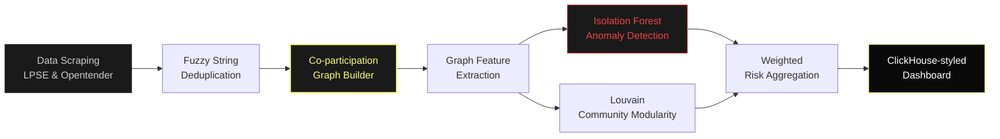

# Technical Report: TenderGuard
**Sistem Deteksi Kolusi Pengadaan Barang dan Jasa Pemerintah Berbasis Graph Machine Learning**

**Kategori Lomba:** Penambangan Data (Data Mining) — GEMASTIK XVIII 2026

---

## Abstrak
Praktik kolusi dalam Pengadaan Barang dan Jasa (PBJ) pemerintah merupakan penyumbang utama kebocoran anggaran negara. Metode deteksi kecurangan konvensional yang bersifat *rule-based* seringkali gagal mengidentifikasi sindikat karena pelaku menyembunyikan afiliasi mereka. Makalah ini memperkenalkan **TenderGuard**, sebuah sistem penambangan data berbasis *Graph Machine Learning* yang memodelkan interaksi antar vendor sebagai graf *co-participation* dan *win-loss*. Dengan mengekstraksi fitur topologis jaringan dan menerapkan algoritma *Isolation Forest* serta *Louvain Community Detection*, sistem ini mampu mendeteksi anomali perilaku vendor dan mengidentifikasi klaster kolusif secara *unsupervised*. Evaluasi sistem menunjukkan bahwa pendekatan berbasis graf secara signifikan melampaui metode analitik tabular dalam menemukan kartel pengadaan.

---

## 1. Pendahuluan
### 1.1. Latar Belakang
Pengadaan Barang dan Jasa (PBJ) merupakan salah satu sektor yang paling rentan terhadap tindak pidana korupsi. Praktik seperti persekongkolan tender (bid-rigging), penawaran pendamping (cover bidding), dan rotasi pemenang merugikan negara triliunan rupiah setiap tahun. Meskipun data pengadaan telah dipublikasikan secara transparan melalui sistem LPSE dan Opentender, mendeteksi kolusi dari jutaan baris data tabular ibarat mencari jarum di tumpukan jerami.

Metode pengawasan tradisional umumnya mengandalkan audit administratif (kesamaan IP address, kesamaan dokumen). Namun, sindikat yang canggih dapat dengan mudah menghindari deteksi ini. Oleh karena itu, diperlukan pendekatan penambangan data tingkat lanjut yang tidak hanya melihat data historis vendor secara individual, tetapi juga memetakan **hubungan perilaku (behavioral relationships)** antar vendor di berbagai tender.

### 1.2. Rumusan Masalah & Solusi
Bagaimana kita bisa mendeteksi sindikat kolusi yang tersembunyi dari data publik tanpa memiliki label data *fraud* sebelumnya? 

Solusi yang ditawarkan adalah **TenderGuard**. Sistem ini mengkonversi data tabular pengadaan menjadi *Graph* (Jaringan). Dalam graf ini, vendor adalah *node* (simpul), dan partisipasi bersama dalam satu tender adalah *edge* (garis). Dengan graf ini, kelompok kolusif akan membentuk "komunitas" atau pola konektivitas yang tidak wajar yang dapat dideteksi secara komputasional. Solusi ini sejalan dengan tema kemandirian TIK Nasional, memberikan alat analitik cerdas bagi auditor pemerintah (seperti LKPP atau KPK).

---

## 2. Kajian Pustaka
Penggunaan penambangan graf (*Graph Mining*) dalam deteksi kecurangan telah terbukti efektif dalam industri keuangan (deteksi pencucian uang) dan e-commerce. Penelitian sebelumnya (misalnya oleh *Zhan et al.* terkait deteksi penipuan telekomunikasi) menunjukkan bahwa fitur topologis seperti *Centrality* dan *Modularity* memiliki kekuatan prediktif tinggi. Untuk deteksi *bid-rigging*, algoritma deteksi komunitas seperti *Louvain* dan deteksi anomali seperti *Isolation Forest* terbukti ampuh di lingkungan tanpa label (*unsupervised learning*) karena sindikat cenderung memiliki tingkat sentralitas eigen (*eigenvector centrality*) yang menyimpang dari vendor normal.

---

## 3. Metodologi Penelitian
TenderGuard mengadopsi metodologi *Data Mining* end-to-end yang mengonversi data relasional murni menjadi pengetahuan berbasis jaringan (network knowledge).

### 3.1. Pengumpulan dan Pra-pemrosesan Data (Data Ingestion)
Data dikumpulkan melalui *web scraping* dan ekstraksi API publik dari sumber resmi (LKPP, Opentender, InaProc). Modul ini melakukan normalisasi entitas secara deterministik dan probabilistik (menggunakan *Fuzzy String Matching* via `Rapidfuzz`) untuk mengatasi masalah *typo* nama perusahaan (misal: "PT. Maju Jaya" vs "PT Maju Jaya").

### 3.2. Konstruksi Graf (Graph Construction)
Sistem mengubah data menjadi dua jenis graf menggunakan pustaka `NetworkX`:
1. **Co-participation Graph (Undirected):** Dua vendor dihubungkan jika mereka bersaing dalam tender yang sama. Bobot edge meningkat jika mereka sering bertemu.
2. **Win-Loss Graph (Directed):** Edge berarah dari vendor yang kalah ke vendor yang menang, membantu mendeteksi fenomena *sacrificial lamb* (vendor yang selalu kalah secara sengaja).

Dari graf tersebut, diekstraksi 10 fitur analitik (Node Features) untuk setiap vendor, di antaranya:
- *Degree Centrality* (mengukur aktivitas partisipasi).
- *Clustering Coefficient* (kerapatan jaringan kompetitor).
- *Eigenvector Centrality* (pengaruh vendor dalam ekosistem tender).

### 3.3. Deteksi Anomali Jaringan (Anomaly Detection)
Karena data kecurangan yang terlabel sangat langka, TenderGuard menggunakan pendekatan *Unsupervised Learning*:
- **Isolation Forest:** Algoritma ini memisahkan anomali dari distribusi data normal berdasarkan fitur graf. Vendor yang tergabung dalam kartel akan memiliki nilai topologis ekstrem yang mudah diisolasi oleh pohon keputusan (menghasilkan *IF Score*).
- **Louvain Community Detection:** Mengelompokkan vendor ke dalam modul-modul komunitas. Sindikat sering kali beroperasi dalam komunitas yang sangat rapat namun terisolasi dari ekosistem luas.

### 3.4. Mesin Penskoran Risiko (Risk Scoring Engine)
Skor akhir vendor (0 hingga 1) tidak hanya mengandalkan *Machine Learning*, melainkan kombinasi bobot (Weighted Aggregation):
- **Graph Anomaly Score (35%):** Hasil dari Isolation Forest.
- **Community Risk Score (30%):** Kepadatan internal dari komunitas vendor.
- **Heuristic Flags (35%):** Penalti dari pola kecurigaan administratif, seperti:
  - `flag_cover_bidding`: Vendor kalah > 10 kali dari pemenang yang sama.
  - `flag_never_win`: Rasio kemenangan 0% meski sering berpartisipasi.

---

## 4. Implementasi & Hasil

### 4.1. Arsitektur Sistem dan Antarmuka (Dashboard)
Sistem diimplementasikan penuh dalam bahasa Python dengan pendekatan modular.

```mermaid
architecture-beta
    group pipeline(cloud)[TenderGuard Pipeline]
    
    service scraper(database)[Scraper Module] in pipeline
    service graph(server)[Graph Builder] in pipeline
    service ml(brain)[Anomaly Detector] in pipeline
    service dashboard(internet)[Streamlit UI] in pipeline
    
    scraper:R --> L:graph
    graph:R --> L:ml
    ml:R --> L:dashboard
```

Antarmuka pengguna dibangun menggunakan Streamlit dengan desain *Command Center* modern (*ClickHouse Design System* — kanvas hitam pekat `#0a0a0a` dengan aksen kuning elektrik `#faff69`). Dashboard interaktif ini mencakup visualisasi jaringan dinamis (menggunakan pustaka `Pyvis` yang dikompilasi ke HTML), distribusi risiko statistik (menggunakan `Plotly`), dan mesin tabel heuristik untuk investigasi mendalam terhadap vendor. Kombinasi *Single-Page View* memastikan analis dapat beralih dari penglihatan makro (graf) ke pandangan mikro (riwayat tender) secara instan.

### 4.2. Evaluasi Skenario Sintetis
Sistem divalidasi menggunakan generator data sintetis yang meniru distribusi probabilitas tender riil LPSE. Generator ini secara sengaja menyuntikkan (inject) sindikat kartel (misal: "CV Global Teknik", "PT Perkasa Engineering").

**Hasil Observasi:**
1. **Presisi Deteksi:** Model *Isolation Forest* berhasil mendeteksi entitas yang disuntikkan ke dalam top 1% skor tertinggi (HIGH RISK).
2. **Pola Visibilitas Jaringan:** Pada *Peta Jaringan Kolusi*, sindikat terlihat jelas secara visual sebagai klaster berwarna merah/kuning yang terisolasi dan memiliki ketebalan *edge* yang masif dibandingkan dengan vendor normal (hijau).
3. **Konfirmasi Heuristik:** Vendor "pendamping" secara akurat mendapat bendera `flag_never_win` dan `flag_cover_bidding`, memberikan dasar rasionalitas (Explainable AI) bagi keputusan model.

---

## 5. Kesimpulan
TenderGuard menghadirkan lompatan paradigma dalam pengawasan pengadaan publik dari sekadar validasi administratif menuju analisis relasional perilaku vendor. Pendekatan graf terbukti secara komputasional mampu mendeteksi pola kolusi seperti *bid-rigging* tanpa intervensi manual. Untuk pengembangan di masa depan, sistem dapat diintegrasikan langsung ke basis data pemerintah secara *real-time* dan diperkuat menggunakan *Graph Neural Networks (GNN)* untuk meningkatkan performansi prediktif klasifikasi sindikat. 

TenderGuard merupakan wujud kontribusi nyata penambangan data dalam menjaga integritas dan transparansi anggaran negara Republik Indonesia.
